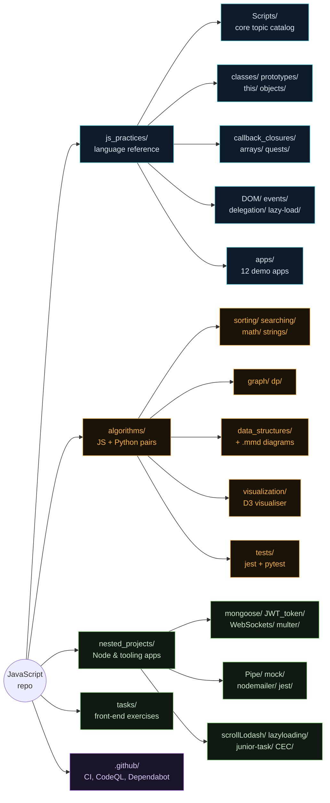
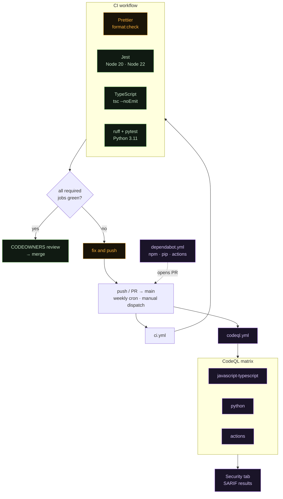

# JavaScript — sandbox & reference database

[](https://github.com/ChewBaccaYeti/JavaScript/actions/workflows/ci.yml)
[](https://github.com/ChewBaccaYeti/JavaScript/actions/workflows/codeql.yml)
[](https://nodejs.org)
[](https://www.python.org)
[](https://prettier.io)
[](https://opensource.org/licenses/ISC)

Personal JavaScript practice field and hand-written reference database. Not one
app — a collection of independent modules exploring the language and the Node
ecosystem, plus **39 classic algorithms implemented twice** (JavaScript and
Python) for interview prep.

The `js_practices/` topic folders follow a fixed house style: one named function
per concept, an immediate call so the file runs standalone, and bilingual RU/EN
comments.

## Table of contents

-   [Quick start](#quick-start)
-   [Repository map](#repository-map)
-   [`js_practices/` — language reference](#js_practices--language-reference)
-   [`algorithms/` — JS + Python pairs](#algorithms--js--python-pairs)
-   [`nested_projects/` — larger projects](#nested_projects--larger-projects)
-   [`tasks/` — front-end exercises](#tasks--front-end-exercises)
-   [Mermaid diagrams](#mermaid-diagrams)
-   [Tests](#tests)
-   [Tooling & config](#tooling--config)
-   [CI / DevOps](#ci--devops)
-   [Known issues](#known-issues)
-   [Docs](#docs)

## Quick start

```bash
git clone https://github.com/ChewBaccaYeti/JavaScript.git
cd JavaScript
npm install

# Python side (algorithms/ pairs)
python -m venv venv311 && source venv311/Scripts/activate   # Windows Git Bash
pip install -r requirements.txt pytest ruff
```

Nothing needs a build step. Every reference file is directly runnable:

```bash
node js_practices/Scripts/Arrays.js          # array methods catalog
node algorithms/sorting/quick.js             # quicksort + example run
python algorithms/graph/dijkstra.py          # the Python pair
npx ts-node nested_projects/Pipe/Pipeline.ts # .ts via ts-node
```

Browser exercises are plain `index.html` files — open them directly, no server
needed:

```text
js_practices/DOM/index.html
js_practices/events/index.html
js_practices/delegation/index.html
js_practices/lazy-load/index.html
algorithms/visualization/index.html          # D3 algorithm visualiser
```

### npm scripts

| Script                 | What it does                                                |
| ---------------------- | ----------------------------------------------------------- |
| `npm test`             | Jest across the whole repo (5 suites, 75 tests)             |
| `npm run test:watch`   | Same, in watch mode                                         |
| `npm run format`       | Prettier `--write` over everything not in `.prettierignore` |
| `npm run format:check` | Prettier `--check` — the CI gate                            |
| `npm run typecheck`    | `tsc --noEmit` over `tsconfig.check.json`                   |
| `npm run algo:test`    | Jest, algorithms only (own config)                          |
| `npm run algo:pytest`  | pytest, `algorithms/tests/python`                           |
| `npm run loops`        | nodemon `js_practices/Scripts/loops/Loops.js`               |
| `npm run loop_exer`    | nodemon `js_practices/Scripts/loops/exercises.js`           |
| `npm run mock`         | nodemon `nested_projects/mock/mock.js`                      |
| `npm run pipe`         | nodemon `nested_projects/Pipe/Pipeline.js`                  |
| `npm run transporter`  | nodemon `nested_projects/nodemailer/transporter.js`         |

Run one test file: `npx jest <path>` or `npx jest --testPathPattern=<pattern>`.

## Repository map



| Directory          | What it is                                                                 |
| ------------------ | -------------------------------------------------------------------------- |
| `js_practices/`    | The core reference: topic folders + browser exercises + `apps/` demo apps  |
| `algorithms/`      | 39 interview algorithms, each in JavaScript **and** Python                 |
| `nested_projects/` | Larger self-contained Node/tooling projects                                |
| `tasks/`           | Standalone front-end task exercises (`task_1`..`task_4`), some with Parcel |
| `.github/`         | Workflows, CODEOWNERS, Dependabot, issue/PR templates                      |

## `js_practices/` — language reference

The curated topic files. **When adding examples, match the existing style:**
named function per concept, immediate call, RU/EN comments, and a checklist of
covered methods at the bottom where one is present.

### Core catalog — `Scripts/`

| File                              | Topic                                                                                           |
| --------------------------------- | ----------------------------------------------------------------------------------------------- |
| `Scripts/Arrays.js`               | Array methods: access, mutate, iterate, search, immutable copies, statics                       |
| `Scripts/Objects.js`              | `Object.*` statics, descriptors, prototypes, freeze/seal, shallow clone vs `structuredClone`    |
| `Scripts/DataTypes.js`            | Primitives, `typeof`, coercion, `==` vs `===`, falsy, `?.` / `??`, symbols                      |
| `Scripts/variables.js`            | `var`/`let`/`const`/`using` — scope, hoisting/TDZ, loop trap, `Symbol.dispose`                  |
| `Scripts/Math.js`                 | `Math.*` — trig/log, rounding, `max`/`min`/`sqrt`/`sign`/`trunc`/`hypot`, constants             |
| `Scripts/Recursion.js`            | Factorial, fibonacci, memoization, iterative form, tree/nested recursion                        |
| `Scripts/Callback.js`             | Callbacks and error-first async chains                                                          |
| `Scripts/Middleware.js`           | The middleware pattern                                                                          |
| `Scripts/alert_prompt_confirm.js` | Browser dialog primitives                                                                       |
| `Scripts/functions/`              | Declarations vs expressions, hoisting, arrow fns, rest/default params, spread, IIFE             |
| `Scripts/loops/`                  | for / while / do-while / for-in / for-of / Set+Map iteration / switch / break-continue / labels |

### Topic folders

| Path                                           | Topic                                                                                                                       |
| ---------------------------------------------- | --------------------------------------------------------------------------------------------------------------------------- |
| `arrays/array_methods/`                        | Iteration methods in depth — `forEach`, `map`, `filter`, `find`, `every`/`some`, `reduce`, `sort`, `flat`, chaining, lodash |
| `arrays/arrays_examples/`                      | 10 applied array exercises (payments, slug, register, cards, …)                                                             |
| `objects/`                                     | Creation, methods, iteration, applied examples (friends, cart)                                                              |
| `classes/`                                     | `class` syntax, `extends`/`super`/`instanceof`, OOP, `new`, getters/setters, private `#`                                    |
| `prototypes/`                                  | Prototype chain, constructor functions, `Object.create`, `__proto__`                                                        |
| `this/`                                        | Binding rules, method vs standalone, `call`/`apply`/`bind`, arrow lexical `this`                                            |
| `callback_closures/`                           | Callbacks, closures (factories, private state, currying, counter, `var`/`let` loop trap), arrow fns                         |
| `DOM/`, `events/`, `delegation/`, `lazy-load/` | Browser exercises, each driven by an `index.html` with `css/`, `js/` siblings                                               |
| `quests/`                                      | Small algorithm challenges (largest triangle, sum of nums)                                                                  |
| `tutorial-lections/`                           | Lecture notes — closures, OOP, DOM props vs attributes, events, fCC                                                         |
| `scratch/`                                     | Loose experiments (`roman-numerals.js`, `check_RAM.py`)                                                                     |

### `js_practices/apps/` — demo apps

Most use **Parcel** and carry their own `package.json` — `cd` in and
`npm install && npm start`.

| App             | Stack / point                                   | Own `package.json` |
| --------------- | ----------------------------------------------- | ------------------ |
| `CRUD`          | json-server backend, full CRUD cycle            | ✅                 |
| `async-await`   | json-server, `async`/`await` over the same API  | ✅                 |
| `async`         | Async patterns                                  | ✅                 |
| `promises`      | Promise chains, Bootstrap UI                    | ✅                 |
| `http-requests` | `fetch` / XHR comparison                        | ✅                 |
| `localStorage`  | Persistence in the browser                      | ✅                 |
| `pagination`    | Client-side paging                              | ✅                 |
| `npm`           | Express + Joi, includes `src/jest/sum.test.js`  | ✅                 |
| `webpack`       | Webpack + SASS build                            | ✅                 |
| `colorPalette`  | Palette generator, no build tool                | ❌                 |
| `crewings`      | Email scraping/filtering (puppeteer, tesseract) | ❌                 |
| `football-game` | Small game loop                                 | ❌                 |

## `algorithms/` — JS + Python pairs

Every algorithm exists twice, with matching structure: heavy RU/EN comments,
Big-O in the header, edge cases, and an example run at the bottom. Full
complexity tables live in **[`algorithms/README.md`](algorithms/README.md)**.

| Category           | Count | Algorithms                                                        |
| ------------------ | ----- | ----------------------------------------------------------------- |
| `sorting/`         | 8     | bubble, selection, insertion, merge, quick, heap, counting, radix |
| `searching/`       | 5     | linear, binary, jump, interpolation, exponential                  |
| `math/`            | 6     | factorial, fibonacci, gcd/lcm, sieve, fast power, prime check     |
| `graph/`           | 6     | BFS, DFS, Dijkstra, Bellman-Ford, Kruskal, topological sort       |
| `dp/`              | 5     | knapsack, LCS, LIS, coin change, edit distance                    |
| `strings/`         | 3     | KMP, Rabin-Karp, Z-algorithm                                      |
| `data_structures/` | 6     | stack, queue, linked list, binary tree, trie, union-find          |

`algorithms/visualization/` is a D3 v7 single-page visualiser (`index.html`)
that animates the binary search tree and linked list; more structures are
slotted in as they get built.

```bash
node algorithms/sorting/merge.js
python algorithms/dp/knapsack.py
npm run algo:test      # Jest over algorithms/tests/js
npm run algo:pytest    # pytest over algorithms/tests/python
```

## `nested_projects/` — larger projects

| Dir             | Stack / what it demonstrates                                                                                                        |
| --------------- | ----------------------------------------------------------------------------------------------------------------------------------- |
| `mongoose/`     | Express + MongoDB REST API, split `api` / `controller` / `service`                                                                  |
| `JWT_token/`    | JWT auth with `passport-jwt`, `api/` + `config/`                                                                                    |
| `WebSockets/`   | Three variants — `Socket.io/`, raw `WebSocket/`, and a `Chat/` server                                                               |
| `nodemailer/`   | Email via nodemailer + SendGrid + Handlebars views, own `package.json`                                                              |
| `multer/`       | File upload handling                                                                                                                |
| `Pipe/`         | Data pipeline over SWAPI, JS + TS, own `package.json` and Jest suite                                                                |
| `mock/`         | Mock data generators, JS + TS pair                                                                                                  |
| `jest/`         | Minimal standalone Jest example (`pow`)                                                                                             |
| `CEC/`          | React + TypeScript `IshimuraDB` snapshot — the live version now lives in the [DS_API](https://github.com/ChewBaccaYeti/DS_API) repo |
| `scrollLodash/` | Throttled scroll with lodash                                                                                                        |
| `lazyloading/`  | Native lazy-loading experiment                                                                                                      |
| `junior-task/`  | Static markup exercise                                                                                                              |

## `tasks/` — front-end exercises

| Task     | Contents                                                         | Build  |
| -------- | ---------------------------------------------------------------- | ------ |
| `task_1` | `index.html` + `css/` + `js/`                                    | none   |
| `task_2` | Gallery and lightbox exercises                                   | none   |
| `task_3` | Vimeo player, feedback form, simplelightbox gallery              | Parcel |
| `task_4` | Colour switcher, timer (flatpickr), promise generator (notiflix) | Parcel |

`task_3` and `task_4` build with `--public-url /JavaScript/`, i.e. they were
written to deploy under the repo's GitHub Pages path.

## Mermaid diagrams

Diagrams are kept as standalone `.mmd` files next to the code they explain, so
they render in the GitHub file view and can be pasted into any Mermaid renderer:

| File                                         | Diagram                        |
| -------------------------------------------- | ------------------------------ |
| `algorithms/data_structures/stack.mmd`       | LIFO push/pop flow             |
| `algorithms/data_structures/queue.mmd`       | FIFO enqueue/dequeue flow      |
| `algorithms/data_structures/linked_list.mmd` | Node chain and pointer surgery |
| `algorithms/data_structures/binary_tree.mmd` | BST insert/search paths        |
| `algorithms/data_structures/trie.mmd`        | Prefix tree layout             |
| `algorithms/data_structures/union_find.mmd`  | Disjoint sets, union by rank   |
| `js_practices/classes/02-inheritance.mmd`    | `extends` / `super` chain      |
| `js_practices/Scripts/loops/Loops.mmd`       | Loop-type decision tree        |

Inline diagrams in Markdown use fenced ` ```mermaid ` blocks — see the
[repository map](#repository-map) above and the CI graph below.

## Tests

Jest runs from the root config (`npm test`) and picks up every suite in the
repo:

| Suite                                        | Covers                        |
| -------------------------------------------- | ----------------------------- |
| `algorithms/tests/js/sorting.test.js`        | All sorting implementations   |
| `algorithms/tests/js/searching.test.js`      | All searching implementations |
| `nested_projects/Pipe/Pipeline.test.js`      | SWAPI pipeline, mocked axios  |
| `nested_projects/jest/pow.test.js`           | Standalone Jest example       |
| `js_practices/apps/npm/src/jest/sum.test.js` | Express + Joi demo app        |

Python tests live in `algorithms/tests/python/` — `conftest.py` puts
`algorithms/` on `sys.path`, so imports read
`from sorting.bubble import bubble_sort`.

Every new algorithm should be tested against at least: empty input, a single
element, sorted input, reverse order, duplicates, and random input. See
[`algorithms/tests/README.md`](algorithms/tests/README.md).

## Tooling & config

| File                   | Purpose                                                                          |
| ---------------------- | -------------------------------------------------------------------------------- |
| `.prettierrc.json`     | 4-space indent, single quotes, trailing commas, 80 cols, `proseWrap: always`     |
| `.prettierignore`      | Excludes lockfiles, vendored sources, `tasks/`, build output, `.hbs`, CODEOWNERS |
| `.markdownlint.jsonc`  | Disables the markdownlint rules that fight Prettier's Markdown output            |
| `babel.config.json`    | `@babel/preset-env` — what `babel-jest` uses to transform test files             |
| `tsconfig.json`        | ES2016 target, commonjs, `jsx: react`, `strict: true`                            |
| `tsconfig.check.json`  | CI type-check scope: `Pipe/` and `mock/` only (see below)                        |
| `nodemon.json`         | `ts-node` for `.ts`, `python3` for `.py`; watches the active dirs                |
| `pyproject.toml`       | pytest paths, ruff (line 100, `E,F,W,I,B,UP`), mypy, pyright                     |
| `requirements.in/.txt` | pip-compile pinned Python deps                                                   |
| `.browserslistrc`      | Target browsers for the Parcel/Webpack apps                                      |

## CI / DevOps



### Workflows

| Workflow                                     | Trigger                                  | Jobs                                                          |
| -------------------------------------------- | ---------------------------------------- | ------------------------------------------------------------- |
| [`ci.yml`](.github/workflows/ci.yml)         | push/PR to `main`, manual                | Prettier, Jest on Node 20 + 22, `tsc --noEmit`, ruff + pytest |
| [`codeql.yml`](.github/workflows/codeql.yml) | push/PR to `main`, Sat 04:22 UTC, manual | CodeQL for `javascript-typescript`, `python`, `actions`       |

Both use `concurrency` groups so a new push cancels the superseded run, and
`permissions: contents: read` by default (CodeQL adds `security-events: write`).

**Formatting is a hard gate.** The whole repo has been run through
`npm run format`, so `format:check` passes from a clean tree — run
`npm run format` before committing or the job fails.

The **type-check job is scoped** via `tsconfig.check.json` to
`nested_projects/Pipe/` and `nested_projects/mock/`. `nested_projects/CEC/` is
an archived snapshot whose dependencies (`react-router-dom`, `helmet`, the
`.jsx` crew components) are not installed here.

### Repo governance

| File                                                                   | Role                                                                                                         |
| ---------------------------------------------------------------------- | ------------------------------------------------------------------------------------------------------------ |
| [`.github/CODEOWNERS`](.github/CODEOWNERS)                             | `@ChewBaccaYeti` owns everything; CI, manifests, and reference dirs listed explicitly                        |
| [`.github/dependabot.yml`](.github/dependabot.yml)                     | Weekly npm at root (grouped dev-tooling vs runtime), monthly for nested projects, `tasks/`, pip, and Actions |
| [`.github/pull_request_template.md`](.github/pull_request_template.md) | Area checkboxes + house-style / test / no-secrets checklist                                                  |
| [`.github/ISSUE_TEMPLATE/`](.github/ISSUE_TEMPLATE)                    | `bug_report.yml`, `new_reference.yml`, plus roadmap contact links                                            |
| [`SECURITY.md`](SECURITY.md)                                           | Private advisory reporting, scanning setup, no-secrets rule                                                  |

### Branch protection (configure in repo settings)

CODEOWNERS only takes effect once reviews are required. Recommended for `main`:

-   Require a pull request before merging, with **1 approval** and **Require
    review from Code Owners**.
-   Require status checks to pass: `Prettier`, `Jest (Node 20)`,
    `Jest (Node 22)`, `TypeScript`, `pytest + ruff`.
-   Require branches to be up to date before merging.
-   Dismiss stale approvals on new commits.

## Known issues

-   **Handlebars templates are unformattable.** Prettier parses `.hbs` /
    `.handlebars` as HTML and throws on partial markup inside `{{#each}}` blocks
    (a `<ul>` opened outside the block and closed inside it). Both extensions
    are in `.prettierignore`.
-   **`nested_projects/CEC/` is stale.** It is a snapshot of an app that has
    since moved to [DS_API](https://github.com/ChewBaccaYeti/DS_API), and its
    dependencies are not installed here. Excluded from the type-check.
-   **`tasks/task_3/.github/workflows/deploy.yml` is dead.** GitHub only reads
    workflows from the repository root `.github/workflows/`, so this nested one
    never runs. It also pins `actions/checkout@v2.3.1` and
    `JamesIves/github-pages-deploy-action@4.1.0`. Move it to the root and bump
    the actions if Pages deployment is wanted.
-   **`TASK_MANAGER_PROJECT.md` has no implementation yet.** The spec describes
    a 5-level progressive project; the `js_practices/projects/task-manager/`
    directory it targets does not exist.
-   **The root `index.html` / `styles.css`** are a leftover freeCodeCamp
    CatPhotoApp exercise, not a project entry point.

## Docs

-   [`LEARNING_ROADMAP.md`](LEARNING_ROADMAP.md) — level-by-level study plan,
    from data types through advanced patterns, mapped to the reference files.
-   [`TASK_MANAGER_PROJECT.md`](TASK_MANAGER_PROJECT.md) — spec for the 5-level
    progressive task-manager project.
-   [`algorithms/README.md`](algorithms/README.md) — complexity tables and the
    full algorithm index.
-   [`algorithms/tests/README.md`](algorithms/tests/README.md) — how to run and
    add tests on both language sides.
-   [`CLAUDE.md`](CLAUDE.md) — guidance for Claude Code sessions in this repo.

## License

ISC © Venedykt Mitishov
